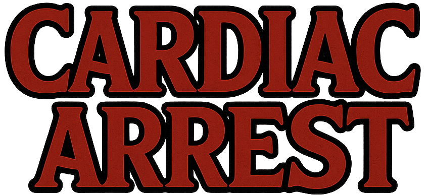
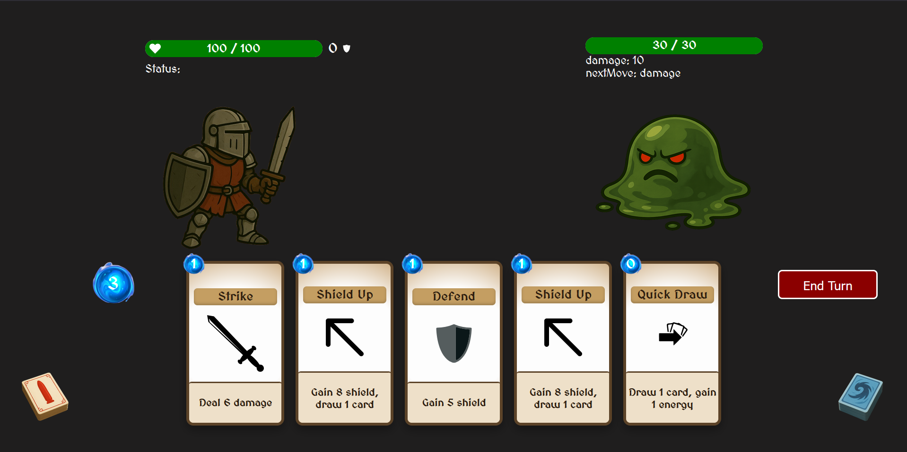

# Cardiac Arrest

A deck-building card battler game where you strategically use cards to defeat enemies and progress through increasingly difficult challenges!

## Game Overview

Cardiac Arrest is a roguelike card-based strategy game where you battle through a series of increasingly difficult enemies before facing the final boss. Build and enhance your deck as you progress, combining powerful card effects to vanquish your foes.

## How to Play

### Game Flow
1. **Start Menu**: Begin your adventure from the start screen
2. **Map Screen**: Navigate through a branching path, choosing your next enemy encounter
3. **Battle Interface**: Engage in turn-based combat using your deck of cards
4. **Victory Screen**: After winning a battle, select a new card to add to your deck
5. **Final Boss**: After defeating all enemies, challenge the boss for ultimate victory

### Battle Mechanics

#### Turn Structure
- **Player's Turn**: 
  - Start with 3 energy
  - Draw 5 cards from your deck
  - Play cards that cost energy
  - End your turn when ready
- **Enemy's Turn**: 
  - Enemy performs one action (attack, buff, or heal)
  - Your shield resets to 0
  - Your turn begins again with a fresh hand

#### Card Types
- **Attack Cards**: Deal damage to enemies
- **Shield Cards**: Grant protection that absorbs damage
- **Buff Cards**: Increase your strength for multiple turns
- **Energy Cards**: Generate additional energy
- **Draw Cards**: Let you draw additional cards

#### Strategic Elements
- **Strength Buff**: Increases the damage of all your attack cards
- **Shield Management**: Blocks enemy damage but resets each turn
- **Deck Building**: Choose new cards wisely to create powerful combinations
- **Resource Management**: Balance energy usage and card effects

### Enemies

The game features various enemies with unique attributes:
- **Slime**: Low health, basic attacks
- **Goblin**: Moderate health and damage
- **Ogre**: High health, powerful attacks
- **Final Boss**: Extreme health and damage with varied attack patterns

Each enemy can:
- **Attack**: Deal damage to you
- **Buff**: Increase their attack damage
- **Heal**: Restore some of their health

## Card Collection

The game includes various cards with different effects:

| Card Name | Cost | Type | Effect |
|-----------|------|------|--------|
| Strike | 1 | Attack | Deal 6 damage |
| Defend | 1 | Shield | Gain 5 shield |
| Buff | 2 | Attack, Buff | Deal 8 damage, gain strength |
| Strike & Defend | 1 | Attack, Shield | Deal 5 damage, gain 5 shield |
| Quick Draw | 0 | Draw, Energy | Draw 1 card, gain 1 energy |
| Shield Up | 1 | Shield, Draw | Gain 8 shield, draw 1 card |
| Invincible | 2 | Shield | Gain 30 shield |
| Double Up | 1 | Shield | Double your shield |
| Shield Slam | 1 | Attack | Deal damage equal to shield |
| Heavy Blade | 2 | Attack | Deal 14 damage + 50% strength bonus |
| Efficient Strike | 1 | Attack, Draw | Deal 9 damage, draw 1 card |
| Energy Boost | 0 | Energy | Gain 2 energy |
| Burning Draw | 1 | Draw | Draw 2 cards |
| Destruction | 2 | Attack | Deal 20 damage |
| Dropkick | 1 | Attack, Energy, Draw | Deal 5 damage, if strength: +1 energy, +1 card |
| Strength | 1 | Buff | Gain 2 strength |
| Annihilation | 3 | Attack | Deal 27 damage |

## Winning the Game

To win Cardiac Arrest, you must:
1. Defeat the first three enemies in sequence
2. Unlock and defeat the final boss
3. Reach the final victory screen

If your health reaches 0 during any battle, you lose and must start over with a fresh deck.

## Technical Implementation

Cardiac Arrest is built using:
- React with TypeScript for UI components and game logic
- Vite for fast development and building
- CSS for styling and animations

Key components:
- `BattleInterface`: Core battle mechanics and turn management
- `Cards`: Card definitions and effects
- `Enemy`: Enemy behavior and AI
- `MapInterface`: Game progression system

## Credits

Cardiac Arrest is a card battler inspired by games like Slay the Spire and other roguelike deck builders, created as a demonstration project to showcase React game development.

## Game Screenshots

### Main Game Elements

#### Map Interface
The map shows your progression path with nodes representing enemy encounters:
- Regular enemies (early encounters)
- Elite enemies (middle encounters)
- Boss (final encounter)

#### Battle Interface
The battle screen contains:
- Player stats (health, shield, buffs)
- Enemy information (health, intent)
- Hand of cards
- Energy counter
- Deck and discard pile
- End turn button

#### Card Interaction
- Cards require energy to play (shown in the crystal)
- Hover over cards to see their full description
- Click a card to play it if you have enough energy

## Project Structure

The project follows a component-based architecture:
- `src/` - Source code
  - `BattleInterface/` - Battle components and logic
  - `UI/` - Menu and navigation components
  - `assets/` - CSS styling
  - `cards.tsx` - Card definitions
  - `App.tsx` - Main game controller

## Development

This project uses:
- React for UI components
- TypeScript for type safety
- CSS for styling

### Testing the Game

The game can be tested by:
1. Starting from the main menu
2. Navigating the map
3. Testing different card combinations in battles
4. Verifying victory and defeat conditions

## Future Improvements

Potential enhancements include:
- More card varieties and synergies
- Additional enemy types with unique behaviors
- Persistent progression between runs
- Audio effects and background music
- Mobile-friendly responsive design

## License

This project is licensed under the MIT License - see the LICENSE file for details.
